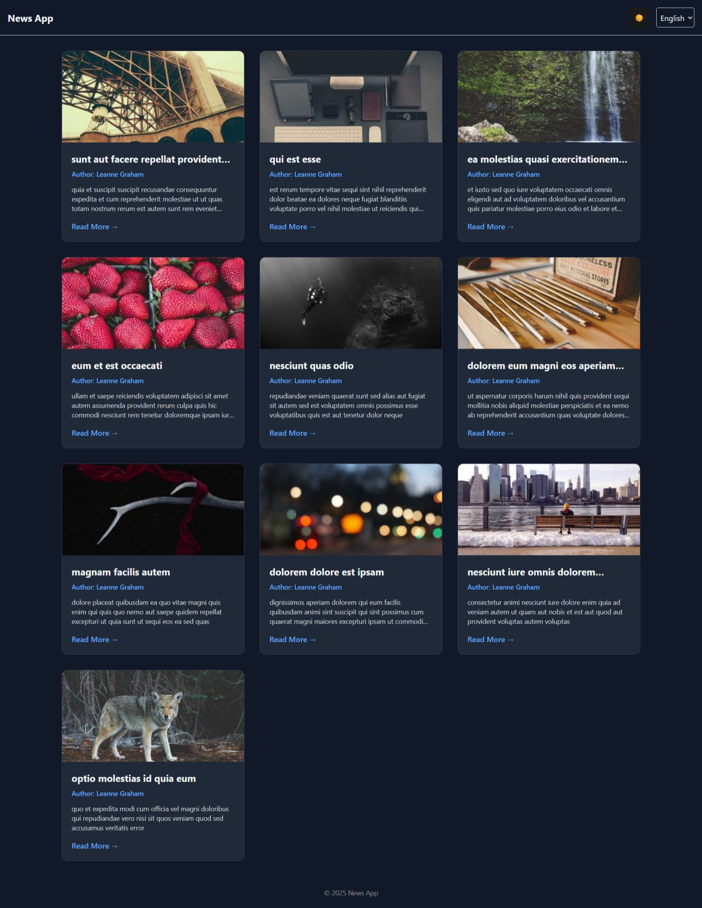
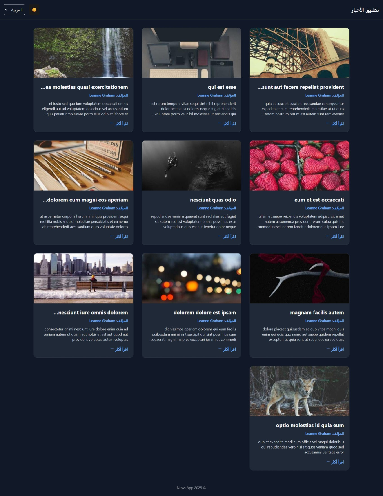
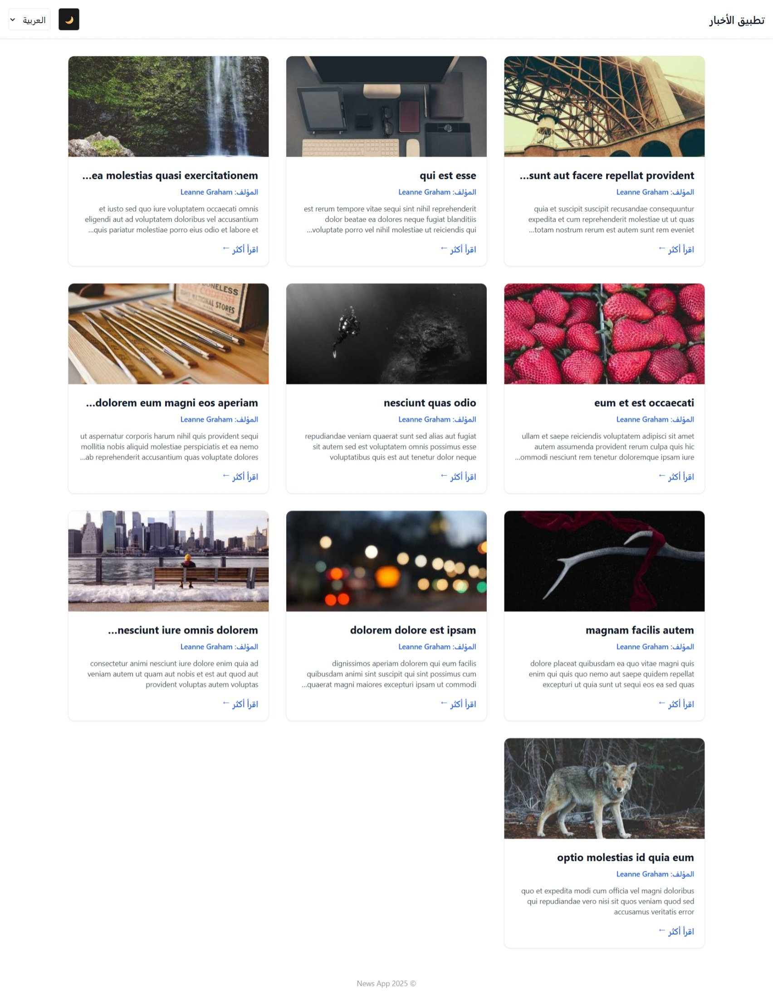

<details>
  <summary>Table of Contents</summary>
  <ul>
    <li>
      <a href="#about">About</a>
      <ul>
        <li><a href="#features">Features</a></li>
        <li><a href="#built-with">Built With</a></li>
      </ul>
    </li>
    <li><a href="#usage">Usage</a></li>
    <li><a href="#live-demo">Live Demo</a></li>
    <li><a href="#getting-started">Getting Started</a></li>
    <li><a href="#contributing">Contributing</a></li>
    <li><a href="#license">License</a></li>
    <li><a href="#feedback">Feedback</a></li>
  </ul>
</details>

## About
This project is a modern React-based frontend application designed to display news or blog posts using reusable and scalable components. It follows best practices in component-based architecture, state management, and UI structuring.

### Features
- 📰 Fetch news posts using **RTK Query**
- 👤 Author data integration using JSONPlaceholder Users API
- 🌗 **Light / Dark Theme Toggle**
- 🌍 **Language Toggle (English / Arabic)**
- 💾 Persist user preferences using **localStorage**
- 🦴 **Skeleton UI** for loading states
- 🖼️ Thumbnail images with **fallback handling**
- 🔁 Clean reusable components
- 🧭 **Post Details Page** with routing
- 🎨 Smooth UI transitions on theme & language change
- 📱 Fully responsive layout

## Built with

[![React][react-image]][react-url]
[![TypeScript][typescript-image]][typescript-url]
[![Redux][redux-image]][redux-url]
[![Tailwind][tailwind-image]][tailwind-url]
[![Vite][vite-image]][vite-url]

## UI Preview

<details>
  <summary><strong>View UI Screenshots</strong></summary>

  ### English • Dark Theme
  

  ### Arabic • Dark Theme
  

  ### Arabic • Light Theme
  

</details>


## Usage
- Browse the list of news posts on the home page
- Toggle **Light / Dark theme** from the header
- Switch UI language between **English and Arabic**
- Click on any news card to view full post details
- Preferences are automatically saved and restored

## Live Demo
Check out the live demo of Flexbox Labs: [Demo](https://flexboxlabs.netlify.app/)

## Getting Started

#### 1. Clone the repository

```shell
git clone https://github.com/SAHFEERULWASIHF/news-app.git
```

#### 2. Navigate to the app directory
```shell
cd news-app
```

#### 3. Install npm dependencies

```shell
npm install
```

#### 4. Run the dev server

```shell
npm run dev
```

#### 5. Open the app in your browser

Visit [http://localhost:5173](http://localhost:5173) in your browser.

## Project Structure
```
src/
├── app/
│   └── store.ts
├── features/
│   ├── api/
│   │   └── newsApi.ts
│   ├── theme/
│   │   └── themeSlice.ts
│   └── language/
│       └── languageSlice.ts
├── components/
│   ├── Header.tsx
│   ├── NewsCard.tsx
│   ├── SkeletonCard.tsx
│   └── ThemeToggle.tsx
├── pages/
│   ├── NewsList.tsx
│   └── PostDetails.tsx
├── routes/
│   └── AppRoutes.tsx
├── styles/
│   └── index.css
├── App.tsx
└── main.tsx

```


## Key Technical Highlights

- Strict TypeScript typing across components
- Centralized state using Redux Toolkit
- API caching & loading handled via RTK Query
- Global theme & language state persisted via localStorage
- Clean separation of concerns
- Junior-friendly but production-ready architecture

## Author

**F Sahfeerul Wasihf**  
Junior Frontend Developer  

- 📧 Email: wasihfwork@gmail.com  
- 📞 Phone: +971 563137364  
- 🔗 LinkedIn: [linkedin.com/in/sahfeerul-wasihf](https://www.linkedin.com/in/sahfeerul-wasihf)  
- 🐙 GitHub: [github.com/SAHFEERULWASIHF](https://github.com/SAHFEERULWASIHF)


[react-image]: https://img.shields.io/badge/React-20232A?style=for-the-badge&logo=react&logoColor=61DAFB
[typescript-image]: https://img.shields.io/badge/TypeScript-3178C6?style=for-the-badge&logo=typescript&logoColor=white
[redux-image]: https://img.shields.io/badge/Redux%20Toolkit-764ABC?style=for-the-badge&logo=redux&logoColor=white
[tailwind-image]: https://img.shields.io/badge/TailwindCSS-0F172A?style=for-the-badge&logo=tailwindcss&logoColor=38BDF8
[vite-image]: https://img.shields.io/badge/Vite-646CFF?style=for-the-badge&logo=vite&logoColor=FFD62E

[react-url]: https://react.dev/
[typescript-url]: https://www.typescriptlang.org/
[redux-url]: https://redux-toolkit.js.org/
[tailwind-url]: https://tailwindcss.com/
[vite-url]: https://vitejs.dev/
